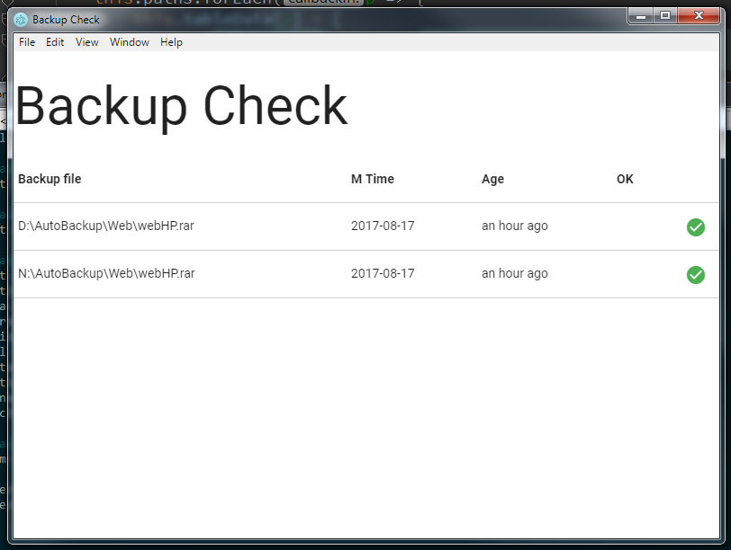

# Backup Check

I've added this to Startup folder in Windows to make sure the backup scripts are running as expected.

# ToDo

* Allow specifying the list of archives to check in a separate text file. This will allow to use the code without recompilation.
